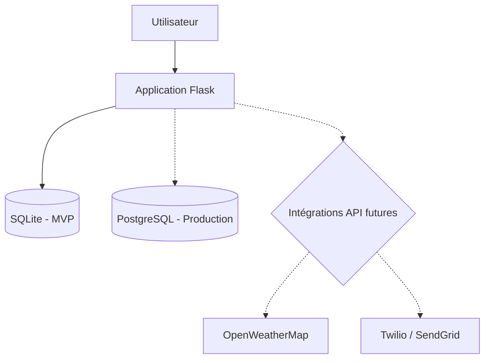

> **Note** : La base de données SQLite est utilisée pour le MVP afin de simplifier le développement. La migration vers PostgreSQL et l'intégration d'API externes (météo, communication) sont prévues pour la phase de production.
